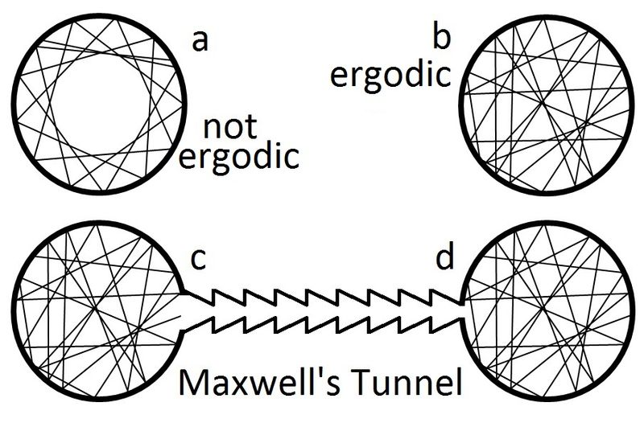

# Best Practices for Foundations in Molecular Simulations (2018)

# Table of Contents

# 1. Introduction

- **Why molecular simulations?**
    
    keywords: predictions, motions, structure
    
    - big picture:
        - to understand and predict the properties, structure and function of molecular systems.
        - a tool to enable predictive molecular design.
    - smaller picture:
        - to study structure and dynamics of a complex system
        - to help interpret experimental data in terms of molecular motions.
        - quantitative prediction of properties of use in molecular design and other applications.
- **How molecular simulations work?**
    - You set up the rules you want based on the system you want to investigate
    - and the system goes by either a deterministic or probabilistic rules to generate a trajectory, which is an evolution of the course of the simulation.
    - The properties that can calculated are stored in a snapshot or frame and average over entire trajectory to compute estimates of desired properties.
- Two types of simulations
    - Molecular Dynamics
        - equations of motions are integrated to generate a dynamical trajectory of the system.
        - uses forces to predict your position of timestep keep propagating.
        - Why MD?
            - to investigate structural dynamic, and thermodynamic properties of the system.
    - Monte Carlo
        - probabilistic rules are used to generate a new configuration from the present configuration and it is repeated to generate a sequence o state to calculate structure and thermodynamic properties because it lacks the concept of time.
        - suggest new units
        - does not take into account time steps unlike MD
        - in most times it is not as efficient as MD
        - “dynamics” in MC is not based on a timeseries, it is an ensemble of configurations that reflect those that could be dynamically sampled.
- **QM vs MM**

- QM
    - Electrons are explicitly represented in the model
    - interaction energy is calculated by solving the electronic structure of the molecules in the system
    - too computationally expensive to get to time/length scale of interest
    - using hundreds of atoms or less
    - no or few empirical parameters, but various approx to physics

- MM
    - Atoms or groups of atoms are explicitly modelled.
        - Each has an electric charge and a potential energy function with large number of empirical parameters used to calculate the non-bonded and bonded interactions.
            - **empirical** — from experiments or observation.
                - fitted to experiments, QM, or other data.
    - Usually used the MM FF to calculate the forces that determine the system dynamics.
    - faster than QM simulations — prime choice for biomolecules.
    - lower accuracy than QM because it cannot simulate bond rearrangement.
    - usually hundred of thousand of atoms
    - coarse grain can go beyond that
    - cannot simulate bond rearrangement. Bond cannot break, formed.

force field- calculating force using Newton’s laws of motion to determine system dynamics.

condensed phase- not the gas phase; liquid or solid phase or combo.

- speed- a concern and it depends on what you are studying and what you want to learn about the system.
    - Why?
        - To mimic real settings, entropic effects needs to be accounted. Entropic effects will leads to fluctuation and correlations of motions affect computed properties. Therefore, an ensemble should be sampled and not just one optimal state.
    - Optimal speed to sample the correct distribution of states?
    - for example, polymers have slow motions that
    - for protein ns - s

- Important notes about MD
    - particles can move around but the chemical identity of the molecule does not change (other than constant pH simulation)
        - fixed protonation states for the components of the system.

<aside>
    🔑 <b>bond breaking and forming is generally NOT ALLOWED</b>.

- The topology and chemistry of a system will remain constant as a function of time.
</aside>

# 3. Science Topics

## 3.1 Classical mechanics

- **point particles** carries:
    - mass
    - electric charge with:
        - bonded interactions (bond lengths, angles, adn torsions)
        - nonbonded (electrostatics and van der waals).
- **rigid body** — particle that do not change their relative orientation as the whole body moves
    - freezing internal degrees of freedom.
    - commonly for water molecules.
        - bc high frequency of O-H vibration
        - If you want to treat water molecule accurately, it requires a smaller timestep (1fs) → slower
        - To increase computational efficiency, we treat it as a rigid body to allow for larger time steps.
- How to determine time step?
    - It is usually for the determined by the *fastest frequency motion*
    - for example, in water, to accurately model the system, it needs a timestep of 1 fs due to its high frequency of O-H vibration
    - Keeping an object rigid in simulation involves applying holonomic constraints.
        - **holonomic constraints** — rigidity is imposed by a fixed bond length and angle during integration of equation of motion.
- Mathematical formulations
    - Newtonian, Hamiltonian, and Lagrangian
- Total energy is conserved remains true in classic mechanics.

## 3.2 Thermodynamics

- Goal is to estimate/predict thermodynamic behaviors of real systems as observed in laboratories.
    - care about both macroscopic (density/heat capacity) and microscopic properties (free energy of a conformation)
- Why statistical mechanics is important?
    - to relate macroscopic and experimental measurements to the behavior of a smaller system that is simulated.
- Temperature
    - we need to understand temperature in terms of statistical mechanics.
    - why? bc we simulate at atomistic level
    - need stat mech to compute what would be observed as macroscopic thermodynamic temperature.
- What are the limitation of thermodynamics?
    - as size of a finite system increase, the particle number density will eventually reach a limit where behavior is bulk-like and does not depend on the extent of the system.
        - smaller systems exhibit microscopic behavior
        - larger systems exhibit macroscopic behavior bc reach thermodynamic limit.
            - bc boundaries and interfaces were removed
        - example: fluctuations in properties is more negligible with increasing system size.
- Usually we think thermodynamics is macroscopic and stat mech is microscopic but thermodynamics holds regardless of length scale.
    - for example, ligand binding to a protein.

## 3.3 Classical statistical mechanics

- **“dwell” time scale** — how long it stays in the basin.
    - this increase exponentially as barrier height increase
    - each small basin is a different rotameric state
    - observing large-scale motion would run longer than the sum of all timescales for the necessary hops.
    - functional biomolecular timescales tend to be $\mu$s to ms
- Connection between MD simulation and equilibrium?
    - MD relaxes a configuration to equilibrium from its starting configuration.
    - In a long trajectory, it should sample the equilibrium average and the frequency sample is proportional to its Boltzmann factor.
    - Boltzmann-factor-weighted is ensemble

- **Ergodicity**
    - a point of a moving system will eventually visit all parts of the space that the system moves in, in a uniform and random sense.
    - If time and ensemble average is the same, then it is ergodic
    - Boltzmann factor distribution implies that :
        - every configuration has some probability
        - unlikely that a single conformation or single basin dominates an ensemble.
        - In a typical MD simulation, it is only a small subset of basins — most accessible configuration to initial structure — that dominates an ensemble.
            - therefore, it is suggested that **multiple MD trajectories starting structures can aid sampling.**

- Representation of systems of enormous complexity (# of atoms) and
    - a small number of coordinates or states.
    - Conformational free energy of a state is to express the average or summed behavior of all the Boltzmann factors contained in a state
- **Potential of mean forces** — probability-determining free energy
    - for Continuous coordinate — distance between two residues in a protein
    - Boltzmann factor of a PMF gives the relative probability of a given coordinate
    - $p_A^{eq}\sim \exp(-F_A/k_bT)$
    - any type of free energy includes entropic effects
    - entropy is indicated by the
        - width of the basin
        - number of arrangement a system can have within a particular state.
- **detailed balance** - fundamental to monte carlo. the newton equation of motion in MD.
    - $p_A^{eq}k_{AB}~=~p_B^{eq}k_{BA}$
        - On and off rate with binding equilibrium constant
- Equilibrium and **non-equilibrium systems**
    - MD does not represent equilibrium systems because they are too short.
    - but living cell have lots of time and they are still not in equilibrium
        - that’s bc there are energy-driven processes — ATP
    - this will not follow a Boltzmann distribution
    - maintaining a non-equilibrium condition is complicated
    - examples: membrane diffusion coefficient by setting up different concentration gradients.
    - last words: frequently, equilibrium methods can provide same or similar information as a non-equilibrium experiment.

## 3.4 Classical electrostatics

- electrostatic (or coulombic) interaction are some of the longest range interactions in molecular systems and the strongest with interaction between charged particles falling off as 1/r
- atom-atom interactions are long-ranged compared to other interactions
    - which means they have quite strong electrostatic interaction despite separating by considerable distances.
- Interactions in non-polar media (non-polar solvent, protein) are longer-range than those in water.
    - long-range interaction factor of $\frac{1}{\epsilon_r}$
    - $\epsilon_r$ is permittivity or static dielectric constant
        - ability to store electric energy in an electrical field
        - relates to degree of its electrostatic response in the presence of a charge
        - ↑ dielectric constant → ↑ response to nearby charges.
    - $\epsilon_r$ of water is 80 → ↓ long range
    - $\epsilon_r$ of non-polar is 2 → ↑ long range

- **Polarizability** —
    - Polarization — separation of opposite charge in an object
    - atoms and molecules have their own electrostatic response and it changes depending on environment.
        - meaning they have their own dielectric constant.
    - Two ways to model polarizability
        1. fixed charge force field — fixed amount of polarization appropriate for simulations in the condense phase
        2. explicitly including polarizability
            1. via QM
            2. via explicit atomic polarizability — classical models with polarizability
            3. via Drude oscillator-type approaches — inclusion of extra particles attached to atoms 

<aside>
🔑 Electrostatic interactions are long-range interactions

</aside>

<aside>
🔑 distant object can contribute more towards total energy and forces than nearby objects in some cases.

</aside>

- Long-range interactions
    - ones distant can be contribute more to energy and forces to the molecular system.
    - need to include ALL electrostatic interactions beyond some cutoff distance.
    - can do in 2 ways
        1. simulate large and finite system — impractical and impossible
        2. apply periodic boundary condition — tile all space with repeating copies of the system. 
            - defining a periodic lattice
            - Including all long range electrostatic interactions via Lattice-sum electrostatics (ewald-type electrostatics)
                - Ewald summation — a method for computing long-range interactions in periodic systems.

## 3.5 Molecular interactions

- Bonded interactions — between atoms that are connected
    - bond stretching, angle bending, terms for rotation of torsional angles
        - torsions involves four atoms and two types of torsions:
            - propers — around bonds connecting groups of atoms
            - impropers — around bonds which involve neighbors of a center atom
                - for correct planarity or non-planarity around a group.
- Non-bonded interactions — all the terms in the potential energy function aside from bonded interactions
    - point charge Coulomb electrostatic interactions
    - “non-polar” interactions modelled by Lennard-Jones potential (short range repulsion and weak long-range interaction.
    - Additional terms may include: (common in polarizable force fields)
        - interactions between fixed multipoles
        - interactions between polarizable sites
        - explicit potentials for H-bonding or other specialized terms
- **Exclusions** — neglect of short range nonbonded interactions between near neighbors
    - A-B or A-X-B the ab nonbonded interactions often neglected
    - specify in potential energy function
    - prob bc of preferred geometries in equilibrium
- Torsions
    - where exclusions ends.
    - the 1-4 interactions usually have *partial* nonbonded interactions.
        - nonbonded interaction is there but reduced
        - electrostatics is to $\frac{1}{1.2}$ of original value
        - lennard jones is $\frac{1}{2}$ of original value.
        - they are the borderline between bonded and nonbonded interactions.
        - can be quite strong and wrong to overestimate / underestimate their effect.

# 4. Basic Simulation Concepts and Terminology

## 4.1. Force Fields

- Force fields are the included terms of the chosen potential energy function with implementation details, parameter values, and particular forms.
    - Non-bonded include
        - Lennard-Jones
            - short range repulsion that scales as $1/r^{12}$
            - long-range attraction scales as $1/r^6$
        - specific to the type of atoms, bonds, molecules , and include point charge on atoms if electrostatic terms are used.
    - Bonded interaction
        - harmonic potential (hooke’s law) are used to represent bonded interaction
            - same for angles
        - torsional are represented through cosine expansion.
    - CG — effect of degrees of freedom, such as solvent, removed from the system
- Force field selection is a form of selecting a model.
    - choices of accuracy, convenience, speed, and conscious of the limitations.

<aside>
🔑 Most MD simulation engines only support a subset of functional forms

</aside>

<aside>
🔑 classical description of dynamics, as implemented in MD, cannot describe all of the chemistry and physics. There is a tradeoff between accuracy and generality / transferability.

</aside>

All the potential energy functions are simply approximations. 

## 4.2. Periodic boundary conditions

- PBC allows for more accurate estimation of bulk properties approximating behavior in small subsystems.
- each particle interacts with period images of particles in the same system.
    - undesirable to interact multiple times → selecting cutoffs
    - cutoffs — used to prevent interacting with one’s image.
        - imposes a lower limit to the size of a periodic simulation box.
    - box must be large enough to capture all of the most significant non-bonded interactions.
- things to consider
    - how dynamic is the protein
    - safe or sorry method? computational resources
    - minimage can tell you if you fall below cutoff or not.

## 4.3 Main steps of a MD simulations

### 4.3.1. System preparation

- input to appropriate simulation package
    - building a starting structure
    - solvation
    - force field
    - building the config of the system in the desired chemical state and other applying FF parameters
    - resemble the equilibrium structure of the system at thermodynamic state point of interest
    - should not be overly unfavorable
    - good starting structure reduce equilibration time
    - should not assume that a system is prepared correctly if it is well-behaved in equilibration steps
    - assignment or development of FF parameter is critical

### 4.3.2. Minimization

- find the local energy minimum of the starting structure so that the MD does not blow up.
- provides the final set of positions and velocities

### 4.3.3. Assignment of velocities

- Minimization will take us to a state from which we can start integrating Newton’s equations of motion without large displacement.
- Velocities are assigned randoming to correct Maxwell-Boltzmann distribution at the desired temperature.
- Simply running different simulations starting with different initial velocities will lead to dramatically different time evolution over long enough times.
    - multiple trials then should do different minimizations to get different initial velocities.

### 4.3.4. Equilibration

- run simulation in a particular thermodynamic ensemble at a particular starting point (target energy, temperature or pressure)
- brings system to a target state point
    - therefore, it is important to make sure that it is minimized.
- For example: NPT when it is equilibrated to a specific volume

### 4.3.5. Production

- collecting data for analysis
- plan to retain and analyze this data
- sometimes they discard initial production data as additional equilibration
    - switch from NPT to NVT
- Analysis
    - computing observables
    - assessing uncertainty in computed properties.

## 4.4. Thermostats

- control the temperature of a simulation, which is often needed for molecular simulations.
- Sampling from canonical (constant temp) ensemble is desired for emulate experiments done in lab conditions (exposed to surroundings)
- Thermostats seek to maintain a target temperature
- Popular thermostats
    - Gaussian - ensure that instantaneous temperature is exactly equal to target temperature
    - Simple velocity rescaling
        - easy
    - Berendsen
    - Bussi-Donadio Parrinello (Canonical Sampling through Velocity Rescaling)
    - Andersen
    - Langevin
    - Nose Hoover

## 4.5. Barostats

- mimic the open air conditions in a laboratory
- constant temp and pressure
- isothermal-isobaric ensemble (most popular ensemble for MD simulations)
- Popular Barostats
    - Simple volume rescaling
    - Berendsen
    - Andersen
    - Parrinello-Rahman
    - Martyna-Tuckerman-Tobias Klein
    - Monte Carlo

## 4.6 Integrators

- approximate the dynamics in discrete manner
- numerical integration of the equations of motion
- Desirable integrator properties
    - induce little error in dynamics
- estimate approximate continuous dynamics
- introduce errors
- minimize discretization error should preserve phase space volume and conserve energy.
- How to choose an appropriate time step?
    - dependent on the choice of integrator and the assumptions used in the integrator's derivation.
    - limited by the highest frequency motion present in the system

## 4.7 Long range electrostatics

- Ewald method - replacing point charge distribution by smooth charge distribution in order to apply existing numerical techniques to solve partial differential eq.
- Grid based Ewald summation
    - charge assignment
    - Transformation of grid to reciprocal space
    - energy calculation
    - transformation of grid back to real space
    - force calculation

# Conclusions

- Give insights on the structure and function of systems at a molecular or atomistic level.
- Compute the thermodynamic and statistical properties and connect to underlying motions, structure and function.

Questions

- Why would the system rattle or blow up if you don't gradually heat up the system?
